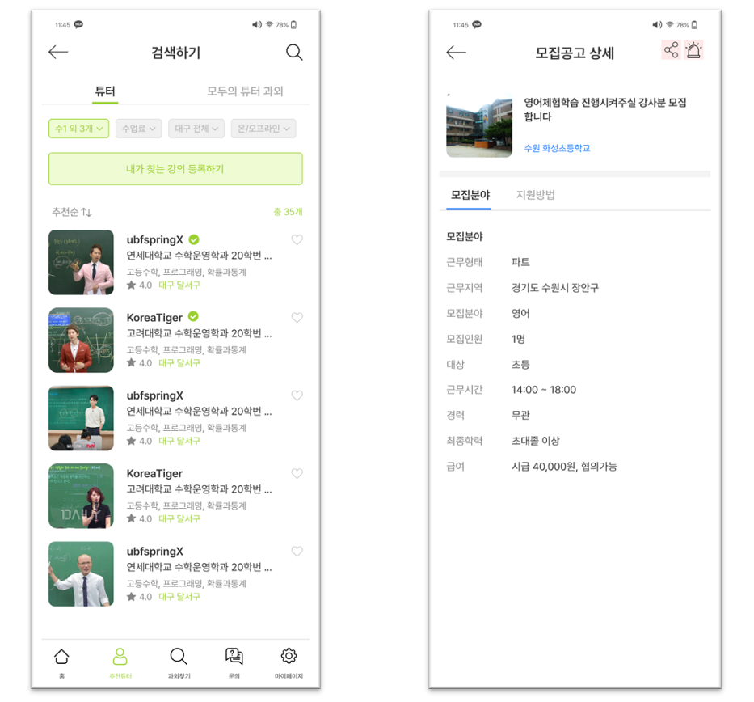
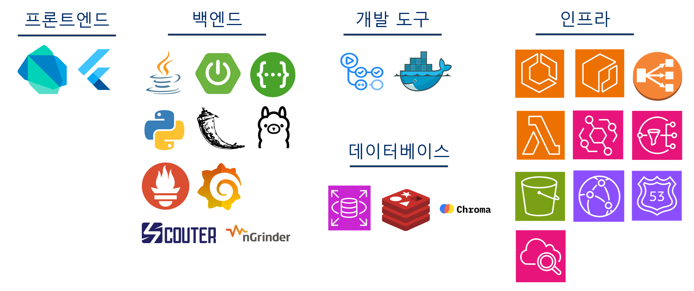
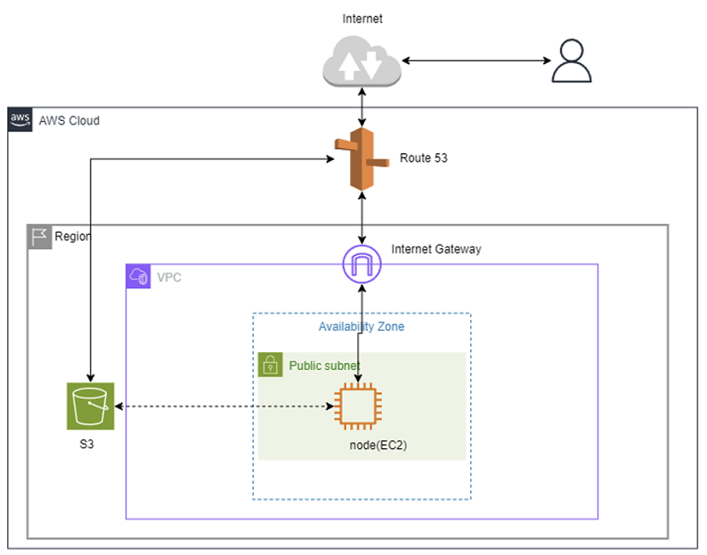
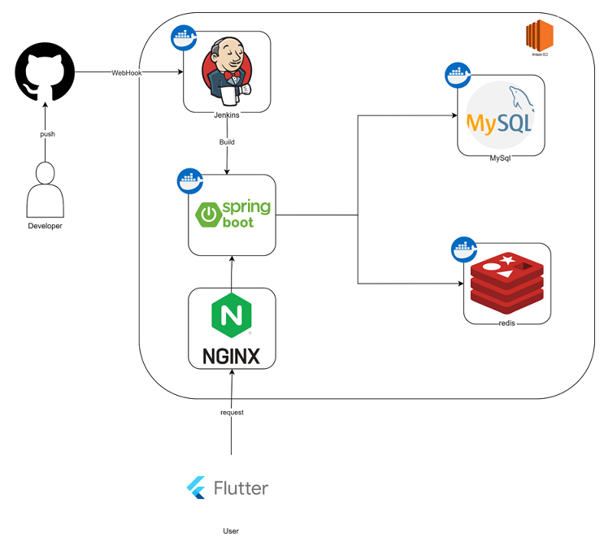
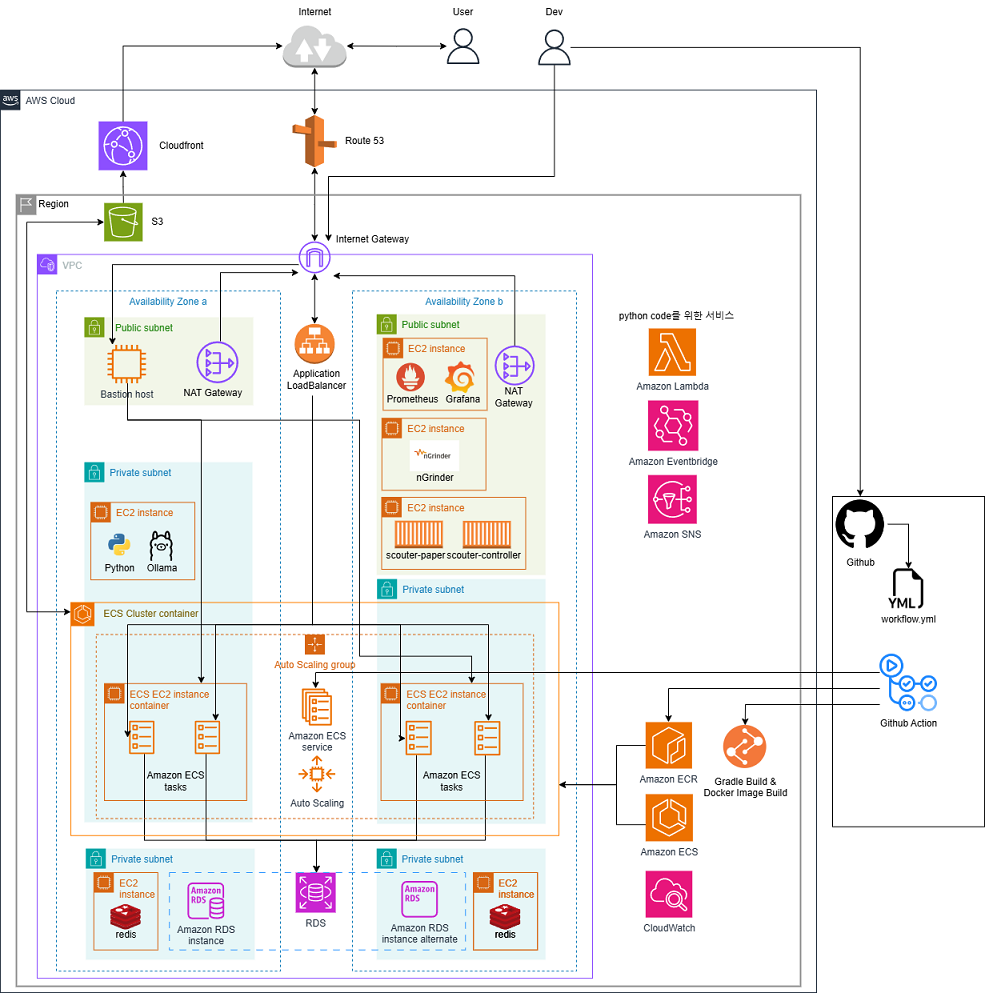
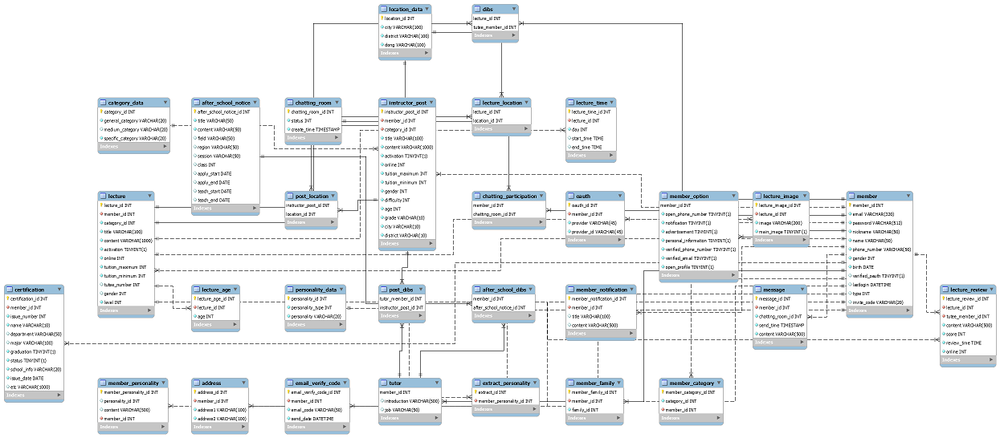
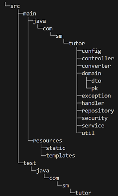
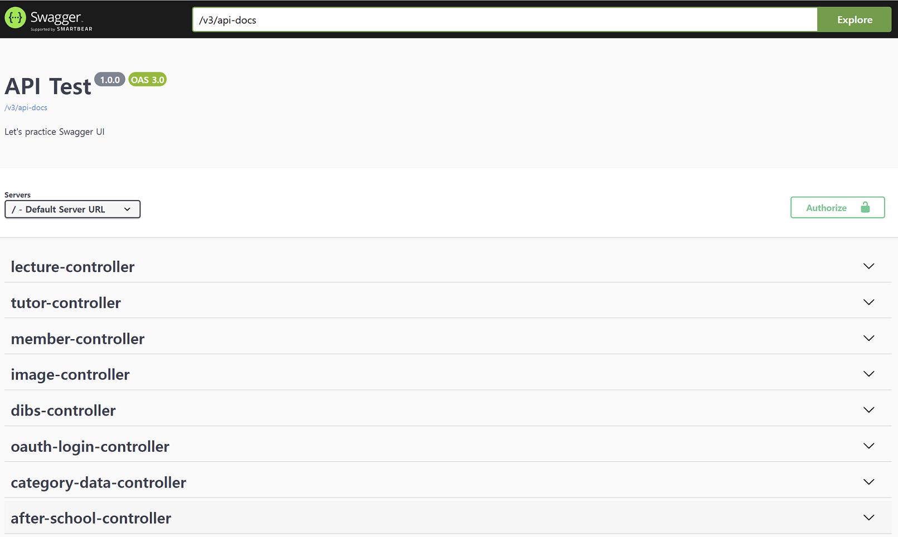

# (모두의 튜터) 튜터 매칭 플랫폼

‘모두의 튜터’는 학생들에게 멘토링, 과외, 입시 컨설팅 등의 다양한 튜터링 활동을 제공하고, 공공기관, 초등학교 및 중학교에서 방과 후 학교 강사로 활동할 수 있도록 매칭해주는 종합 교육 서비스입니다. 이를 통해 학생들은 의미 있는 학습 경험을 쌓고, 튜터들은 전문성을 발휘하며 일자리를 얻을 수 있습니다. 또한, 기관들은 필요한 인력을 효율적으로 확보할 수 있어 교육의 질을 높이는 데 기여합니다.

## 목차

* [주요기능](https://github.com/LocalGovernmentx/TutorPlatform/blob/main/README.md#주요-기능)
* [Tech stack](https://github.com/LocalGovernmentx/TutorPlatform/blob/main/README.md#Tech-stack)
* [Architecture](https://github.com/LocalGovernmentx/TutorPlatform/blob/main/README.md#Architecture)
* [ERD](https://github.com/LocalGovernmentx/TutorPlatform/blob/main/README.md#ERD)
* [Package structure](https://github.com/LocalGovernmentx/TutorPlatform/blob/main/README.md#Package-structure)

## 주요 기능

### 튜터 입장
- 주요 기능1: 튜터가 자신 있는 강의 등록
- 주요 기능2: 튜터 개인 프로필 등록 및 수정
- 주요 기능3: 학부모/튜티가 평가하는 평점/리뷰 확인
- 주요 기능4: 튜티의 공고 찜하기
- 주요 기능5: 방과후 강사 공고 확인

### 학부모/튜티 입장
- 주요 기능1: 본인의 성향과 맞는 튜터 매칭
- 주요 기능2: 튜터의 정보 확인 및 검색
- 주요 기능3: 튜터의 강의 찜하기
- 주요 기능4: 튜터에게 튜터링 제안 (채팅 방식)
- 주요 기능5: 튜터링이 끝난 후 튜터에 대한 평가 및 리뷰 작성

### 자녀 입장
- 주요 기능1: 본인의 성향과 맞는 튜터 매칭
- 주요 기능2: 튜터의 정보 확인 및 검색
- 주요 기능3: 튜터의 강의 찜하기

## Tech stack

## Architecture

### 초기 구성도

### 최종 구성도

## ERD

## Package structure

## API Specs

